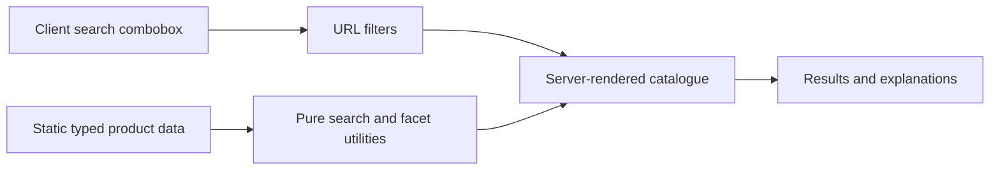

# BuildMatch

[](https://github.com/paulvarghese7/building-materials-discovery/actions/workflows/ci.yml)

BuildMatch is a focused building-material product-discovery prototype created for a Full Stack Developer take-home assignment. It demonstrates how users can find a product when they know either its identity or the performance outcome they need.

The catalogue and all technical values are fictional demonstration data. They are not certified construction information.

## Problem and approach

Building-material catalogues must serve users arriving with different levels of product knowledge. One person may search for a product name or SKU; another may only know that a project needs acoustic, fire, or moisture performance.

BuildMatch supports both paths:

- **Product-first discovery:** search by product name, SKU, category, feature, or description.
- **Need-first discovery:** browse and filter by acoustic, fire, or moisture performance.
- **Transparent recovery:** explain typo interpretation and offer explicit ways to broaden an unsuccessful search.

The scope is deliberately small: 20 products, four categories, and three performance needs. This keeps the prototype deep enough to demonstrate product discovery without imitating an enterprise product-information system.

## Product highlights

- Responsive homepage, catalogue, filters, empty states, and product-detail routes.
- Shareable URL state through `q`, `category`, and `need` query parameters.
- Deterministic search relevance with stable result ordering.
- Guarded typo recovery only after global exact search returns zero results.
- Accessible autocomplete shared by the homepage and catalogue.
- Contextual category and performance counts that preserve the other active constraints.
- Human-readable match explanations on product cards.
- Linked category/performance tags and same-category discovery from product details.
- Targeted empty-state actions that preserve unrelated valid filters.
- Loading, error, not-found, and fictional-data states.

Useful routes to try locally:

```text
/products?q=board
/products?q=quietbaord
/products?category=boards&need=fire
/products?category=profiles&need=fire
/products/quietboard-15
```

## How guided search works

Search is intentionally deterministic and implemented with pure TypeScript utilities rather than a hosted search service.

| Search field | Weight |
| --- | ---: |
| SKU | 100 |
| Product name | 80 |
| Category / performance need | 50 |
| Feature | 30 |
| Short description | 20 |
| Description | 10 |

Exact token, prefix, and substring matches use decreasing multipliers. Full-field equality and full-phrase containment receive additional bonuses. Every normalized query token must match, results are ordered by relevance, and ties retain original dataset order.

Typo recovery runs only when exact search has no global matches. It uses bounded Damerau-Levenshtein distance for eligible alphabetic tokens, excludes short/numeric/SKU-like values, preserves the original URL, and tells the user which spelling was interpreted. Facet counts reuse that single resolved interpretation so the filters never disagree with the results.

## Architecture



- **Next.js App Router:** server-rendered catalogue and detail pages with static product-detail generation.
- **Small client boundary:** only the shared search control owns interactive input, debounce, and navigation state.
- **Static typed data:** no backend, database, CMS, or deployment-time data dependency.
- **URL as application state:** catalogue views remain bookmarkable, shareable, and compatible with browser navigation.
- **Flexible specifications:** `Specification[]` supports different product families without category-specific optional fields.

## Accessibility and responsive behavior

- Semantic headings, landmarks, lists, navigation, status messages, and native GET-form fallback.
- WAI manual-selection combobox behavior with Arrow keys, Enter, Escape, and Tab.
- Visible keyboard focus, meaningful accessible names, and minimum touch-target sizing.
- `aria-busy` on the search region during catalogue navigation and polite result announcements.
- Mobile filter disclosure, persistent desktop filters, responsive product grids, and wrapping recovery actions.
- No essential meaning is communicated by color alone.

## Engineering quality

The project includes 61 focused tests covering product data, URL parsing, filtering, relevance ranking, typo recovery, contextual facets, suggestions, detail navigation, and empty-state recovery.

GitHub Actions runs the following quality gate on Node.js 24:

```bash
npm run lint
npm run typecheck
npm test
npm run build
```

Run the complete gate locally with:

```bash
npm run check
```

## Running locally

Requirements:

- Node.js 24
- npm

```bash
git clone https://github.com/paulvarghese7/building-materials-discovery.git
cd building-materials-discovery
npm ci
npm run dev
```

Open [http://localhost:3000](http://localhost:3000).

## Research and decisions

- [Investigation and source rationale](./docs/investigation.md)
- [Locked and implemented product decisions](./docs/decisions.md)
- [Fictional product dataset matrix](./docs/product-matrix.md)

The research informed the taxonomy, discovery model, information hierarchy, and accessibility requirements. Later implementation decisions are recorded separately so historical evidence is not rewritten to justify the final code.

## Data disclaimer

All product names, SKUs, descriptions, specifications, and technical values in BuildMatch are fictional demonstration content. They are not certified construction information and must not be used for engineering, specification, procurement, or construction decisions.

## Intentional exclusions and limitations

BuildMatch does not include authentication, a backend, database, CMS, comparison tool, configurator, recommendation engine, ecommerce, or AI-powered search. Those features would add operational or domain complexity without improving the assignment's core product-discovery objective.

The dataset is intentionally small, the taxonomy is simplified, fuzzy matching is conservative, and performance tags indicate discovery relevance rather than certified standalone product or system performance.

## AI-assisted workflow

AI tools supported brainstorming, research assistance, implementation assistance, and review/debugging. Product decisions, source interpretation, scope choices, code changes, and submitted behavior were reviewed and tested by the candidate. The application does not use AI at runtime.

## Deployment

The production URL and final interface screenshots will be added after the release branch is merged to `main` and the deployed routes have passed the same search, keyboard, and responsive checks.
